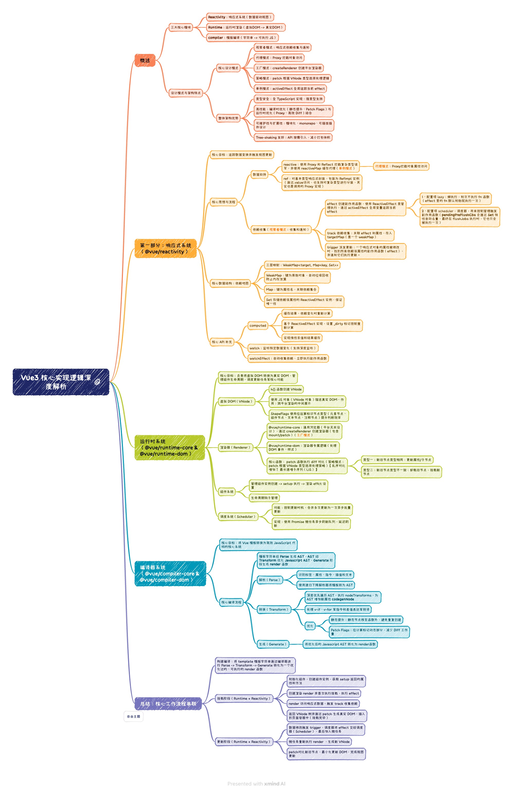

<ArticleNavigation 
  :showBreadcrumb="true"
  :showRelatedArticles="false"
/>

## 概述

Vue3 是一个采用 TypeScript 构建的现代化前端框架，其源码在架构设计上实现了高度的模块化和可扩展性。整个项目采用 `monorepo` 架构管理，核心由三大系统构成：**响应式系统**、**编译器系统**和**运行时系统**。这三大系统协同工作，将用户编写的模板和逻辑高效地转换为可交互的、高性能的 Web 界面。

* **@vue/reactivity**: 提供了与框架无关、可独立使用的响应式能力。
* **@vue/compiler-core**: 负责将模板字符串编译为渲染函数。
* **@vue/runtime-core**: 包含渲染器、虚拟 DOM、组件系统和生命周期等核心运行时功能。

---

## 一、响应式系统 (Reactivity System)

响应式系统是 Vue 的心脏，它使得数据状态的变化能够被自动侦测并反映到视图上。Vue 3 彻底重构了这一系统，用 ES6 `Proxy` 替代了 Vue 2 的 `Object.defineProperty`。

### 1.1 核心思想与流程

1.  **数据劫持**: 通过 `reactive()` 函数，使用 `Proxy` 创建一个代理对象来包装原始数据。
2.  **依赖收集 (Track)**: 当一个 `effect` (副作用，如组件的渲染函数) 运行时，会访问代理对象的属性。这会触发 `Proxy` 的 `get` 陷阱，进而调用 `track` 函数，将当前的 `effect` 与被访问的属性进行关联。
3.  **派发更新 (Trigger)**: 当代理对象的属性被修改时，会触发 `Proxy` 的 `set` 陷阱，进而调用 `trigger` 函数，找到所有依赖该属性的 `effect` 并重新执行它们。

### 1.2 核心数据结构：依赖地图

为了精确地存储依赖关系，Vue 3 设计了一个三层嵌套的 `WeakMap -> Map -> Set` 结构。

> ```
> WeakMap<target, Map<key, Set<effect>>>
> 
> WeakMap {
>   target1 (原始对象): Map {
>     'property1' (属性名): Set { effect1, effect2 }, // 依赖该属性的 effect 集合
>     'property2': Set { effect3 }
>   },
>   target2: Map { ... }
> }
> ```

* **WeakMap**: 键是原始对象，值为 `Map`。使用 `WeakMap` 可以防止内存泄漏，当原始对象被垃圾回收时，对应的依赖关系也会被自动清除。
* **Map**: 键是属性名，值为 `Set`。
* **Set**: 存储所有依赖该属性的 `ReactiveEffect` 实例，`Set` 的特性保证了 `effect` 的唯一性。

### 1.3 核心 API 实现

* **`reactive(target)`**:
    * **作用**: 将复杂数据类型（对象、数组）转换为深度响应式代理。
    * **实现**: 内部调用 `createReactiveObject`，使用 `Proxy` 和 `Reflect` 进行数据劫持。通过一个全局的 `reactiveMap` (WeakMap) 缓存已创建的代理，确保同一个对象只被代理一次，保证了单例和引用一致性。
  

* **`ref(value)`**:
    * **作用**: 为原始值（string, number, boolean）或对象创建一个响应式的引用。
    * **实现**: 本质是将其包装在一个 `RefImpl` 类的实例中，通过访问器属性 `.value` 的 `get` 和 `set` 来分别调用 `trackRefValue` 和 `triggerRefValue`。如果 `ref` 包装的是一个对象，其内部会自动调用 `reactive` 进行深度转换。

* **`computed(getter)`**:
    * **作用**: 创建一个计算属性，其结果会被缓存，仅在依赖项变化时才重新计算。
    * **实现**: 内部也是一个 `ReactiveEffect`，但其调度器 (`scheduler`) 的作用是在依赖变化时不立即重新计算，而是将一个 `_dirty` 标记设为 `true`。只有当用户再次访问 `.value` 且 `_dirty` 为 `true` 时，才会执行计算。这实现了**惰性求值 (Lazy Evaluation)** 和缓存。

* **`effect(fn, options)`**:
    * **作用**: 创建一个副作用函数，它会立即执行并自动收集其执行期间访问的所有响应式依赖。
    * **实现**: 关键在于 `ReactiveEffect` 类。在执行其 `run` 方法时，会先将自身实例赋值给一个全局变量 `activeEffect`，然后执行用户传入的 `fn`。`fn` 中对响应式数据的访问会触发 `track`，`track` 正是收集这个 `activeEffect`。执行完毕后，`activeEffect` 会被清空。

---

## 二、编译器系统 (Compiler System)

编译器负责将用户编写的模板（Template）转换为浏览器可执行的渲染函数（Render Function），这是 Vue 实现“声明式渲染”和进行大量性能优化的关键。

### 2.1 核心编译流程 (三阶段)

`Template String → Parse → AST → Transform → Optimized AST → Generate → Render Function`

1.  **解析 (Parse)**:
    * **作用**: 将模板字符串解析为抽象语法树 (AST)。
    * **实现**: 采用**递归下降解析器 (Recursive Descent Parser)**，逐字扫描模板字符串，识别标签、属性、指令、插值、文本等，并构建成层级的 AST 节点树。

2.  **转换 (Transform)**:
    * **作用**: 遍历并操作 AST，进行优化和转换，为代码生成做准备。
    * **实现**: 采用**深度优先遍历**访问 AST 节点。在遍历过程中，会执行一系列可插拔的转换函数（`nodeTransforms`），例如处理 `v-if`、`v-for` 等指令，合并相邻的文本节点等。
    * **核心优化**:
        * **静态提升 (Static Hoisting)**: 将纯静态的 VNode 提升到渲染函数外部，避免在每次渲染时重复创建。
        * **Patch Flags**: 在编译时分析节点的动态部分（如动态 class、style、props 等），并用一个数字（位掩码）进行标记。在运行时 `patch` 阶段，渲染器只需对比标记的动态部分，大大减少了 Diff 的工作量。

3.  **生成 (Generate)**:
    * **作用**: 将优化后的 AST 转换为渲染函数的代码字符串。
    * **实现**: 遍历优化后的 AST，拼接成最终的 `render` 函数代码。这个函数接收 `_ctx` (渲染上下文) 和 `_cache` (缓存) 作为参数。

---

## 三、运行时系统 (Runtime System)

运行时系统负责执行由编译器生成的渲染函数，管理组件的生命周期、渲染和更新。

### 3.1 核心组成

* **虚拟 DOM (VNode)**:
    * 用 JavaScript 对象来描述真实 DOM 节点的结构。`h()` 函数是创建 VNode 的主要方式。
    * **ShapeFlags**: VNode 中一个重要的属性，使用位运算来高效判断节点及其子节点的类型（如元素、组件、文本子节点、数组子节点等），避免了运行时的动态类型检查。

* **渲染器 (Renderer)**:
    * **跨平台设计**: Vue 3 的渲染器是平台无关的。它通过 `createRenderer` 函数接收一个包含平台特定操作（如创建元素、插入节点、设置属性等）的 `RendererOptions` 对象，从而可以渲染到不同平台（如 DOM、Canvas、SSR 等）。
    * **核心 `patch` 函数**: 这是渲染器的核心，负责对比新旧 VNode 并将变化应用到真实 DOM。它根据 VNode 的类型和 `shapeFlag` 采取不同的处理策略。

* **组件系统**:
    * 管理组件实例的创建、`setup` 函数的执行、`props` 和 `slots` 的处理，以及生命周期钩子的注册和调用。
    * 组件的挂载 (`mountComponent`) 和更新 (`updateComponent`) 流程都围绕着 `setupRenderEffect` 展开，该函数创建了一个渲染 `effect`，将组件的渲染过程与响应式系统连接起来。

* **调度系统 (Scheduler)**:
    * **作用**: 控制和优化更新时机，将多次同步的更新合并为一次异步的批量更新。
    * **实现**: 当 `trigger` 触发更新时，相关的 `effect` 并不会立即执行，而是被放入一个队列中。Vue 使用 `Promise.resolve().then()` (微任务) 来异步地、批量地刷新这个队列，从而避免了不必要的重复渲染。

---

## 四、核心工作流程串联

以下是 Vue 3 从模板到最终视图更新的完整工作流程：
1. 构建编译：将 template 模版字符串通过编译器进行 Parse -> Transform -> Generate 转化为一个优化过的、可执行的 render 函数
2. 挂载阶段（Runtime + Reactivity）
    1. 初始化组件，创建组件实例，获取 setup 返回的属性和方法
    2. 创建渲染 render 并首次执行挂载，执行 effect
    3. render 访问响应式数据，触发 track 收集依赖
    4. 返回 VNode 树并通过 patch 生成真实 DOM，插入到页面容器中（挂载完毕）
3. 更新阶段（Runtime + Reactivity）
    1. 数据修改触发 trigger，调度器将 effect 交给调度器（Scheduler），最后加入微任务
    2. 微任务重新执行 render ，生成新 VNode
    3. patch对比新旧节点，最小化更新 DOM，完成视图更新
  
## 五、设计模式与架构特点
### 核心设计模式:

- 观察者模式: 响应式系统的依赖收集与通知。
- 代理模式: 使用 Proxy 对象属性访问的拦截。
- 工厂模式: createRenderer 根据不同平台的配置创建不同的渲染器。
- 策略模式: patch 函数根据不同的 VNode 类型选择不同的处理策略。
- 单例模式: 如 activeEffect 作为一个全局单例来追踪当前 effect。

### 整体架构优势:

- 高性能: 编译时优化（静态提升、Patch Flags）与运行时优化（Proxy、高效 Diff 算法）相结合。
- 可维护性与扩展性: monorepo 架构、模块化设计、平台无关的渲染器以及可插拔的编译器转换插件，使得框架易于维护和扩展。
- 类型安全: 完全使用 TypeScript 编写，提供了强大的类型支持，提升了代码的健壮性。
- Tree-shaking 友好: API 设计充分考虑了按需引入，有助于减小最终打包体积。

## 总结
Vue 3 的源码是一套设计精良、高度工程化的现代前端框架典范。它通过基于 Proxy 的精确响应式系统、高度优化的编译器以及灵活可扩展的运行时，实现了性能与开发体验的完美平衡。理解其核心逻辑，不仅能帮助我们更好地使用 Vue，也能为我们自己的软件工程实践提供宝贵的启示。

